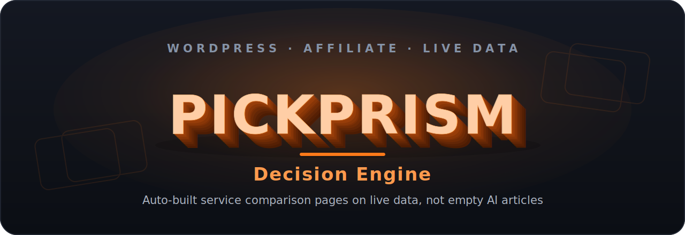

<div align="center">

[Русский](README.md) · **English**



<br>

[](https://wordpress.org/)
[](https://www.php.net/)
[](https://vitejs.dev/)
[](#project-roadmap-stage-3-of-8)
[](LICENSE)

### A site that auto-builds service comparison pages on live data and earns affiliate commissions

**Not empty AI-written articles, but real prices and features in tables that update themselves.**

</div>

---

## The idea in plain words

People choose which service to use: which hosting to pick, which CRM, which website builder, which VPN. Usually they open a dozen tabs, dig through websites, compare plans by hand, and still end up unsure.

**PickPrism** hands them one ready page. On it are real numbers: plans, limits, key features, pros and cons, laid out in a table. The person makes a decision fast and leaves through an affiliate link, and the project earns a commission for it.

Plenty of affiliate sites work this way. PickPrism differs in two things:

- **Comparison pages are assembled from data, not written one by one by hand.** This makes it possible to cover hundreds of "X vs Y" and "alternatives to X" queries without manual work on every page.
- **The data is live.** Prices and specs are not frozen into the text on the publish date; they are pulled in and update themselves. A regular blog has stale numbers half a year later, PickPrism keeps them fresh. That is the whole value.

This is a personal digital asset: it is built once and then runs and earns in the background.

## Project roadmap: stage 3 of 8

The project is built in stages, from idea to a working asset. The first two stages are done, the third is in progress.

```
Stage 3 of 8   ███████▌░░░░░░░░░░░░░   37%
```

> The plan below is a draft. Stage wording is being refined as the project evolves.

| # | Stage | What it means | Status |
|---|---|---|---|
| 1 | **Concept and strategy** | The Decision Engine idea, picking the niche (software service comparison), the affiliate-commission business model | ✅ Done |
| 2 | **Design and presentation layer** | The WordPress theme: storefront, articles, search, feed, category pages, comments. This is what lives in the repository | ✅ Done |
| 3 | **Content model and service data** | Content structure: a "service" type with attributes (price, plan, features) and a "comparison" type. Initial content | 🔸 **In progress** |
| 4 | **Live-data engine** | Collecting, normalizing and auto-updating prices and features from sources. Cache and update scheduling | ⬜ Ahead |
| 5 | **Auto-generated comparison pages** | Templates for "X vs Y", "alternatives to X", roundups. Pages assembled from data automatically | ⬜ Ahead |
| 6 | **Monetization** | Affiliate networks, links, ids, click tracking, conversion analytics | ⬜ Ahead |
| 7 | **SEO and launch** | Technical SEO, indexing, semantics, public launch of the site | ⬜ Ahead |
| 8 | **Growth and automation** | Scaling content, analytics, optimization, new niches | ⬜ Ahead |

**Where we are now.** The look and all the mechanics of the site as a storefront blog are fully done (stages 1-2). Work is underway on how to store and describe the services and comparisons themselves (stage 3). The live-data engine, auto-generated comparison pages and monetization are ahead.

## What already works

The finished presentation layer is a complete WordPress theme. What it has:

- **Instant search** in a dropdown: type, and results appear on the fly
- **Infinite feed** of articles with autoload on scroll
- **Pinned posts** with manual ordering
- **Managed header and footer content** through friendly admin fields (ACF), no code edits
- **A page with all categories** at `/categories/`
- **Nice covers without images**: if a post has no photo, a neat gradient with the category's initial is drawn, each post keeping its own stable color
- **Reading time, reading progress bar, scroll-to-top button, mobile menu**
- **A custom comment system** with spam protection and an "Author" badge
- **Smooth block reveals** that respect the system "reduce motion" setting

All of this stays fast even with 1000+ posts and is ready to have the data engine layered on top.

## How it will work

```
                                  ┌──────────────────────────────┐
   Data sources       ─────────▶  │   Data engine (stages 4-5)    │
   (prices, features)             │   collect · update · cache    │
                                  └──────────────┬───────────────┘
                                                 │  comparison tables
                                                 ▼
   ┌───────────────────────────────────────────────────────────────┐
   │            WordPress (this theme, stages 1-2, done)            │
   │   templates · design system · REST search/feed · ACF · sticky  │
   └──────────────┬─────────────────────────────┬──────────────────┘
                  │                              │
                  ▼                              ▼
        Comparison pages               Affiliate links
        "X vs Y", "alternatives"       (commission per click-through)
```

The theme is built the classic way (not FSE): predictable PHP, custom design, minimal dependencies. Such a foundation easily survives having the data engine plugged in on top and does not get in the way of speed.

## Stack

- **WordPress 6.0+**, classic theme (not FSE), **PHP 7.4+** (tested on 8.2)
- **SCSS + Vite 5** for the build, **Vanilla JS**, no frameworks
- **ACF PRO** for managed content (the "Site settings" options page)
- **Theme REST API**: `/wp-json/pickprism/v1/search` and `/feed` with rate limiting and cache
- **Inter + Manrope** fonts, animations on CSS + `IntersectionObserver`
- Recommended companion plugins: **LiteSpeed Cache**, **Rank Math SEO**, **Wordfence**

## Repository structure

```
pickprism/
├── style.css                       Theme metadata
├── functions.php                   Entry point, loads /inc
├── front-page.php home.php single.php   Home / blog / article
├── archive.php category.php tag.php search.php 404.php
├── header.php footer.php sidebar.php index.php comments.php
│
├── inc/                            Logic modules
│   ├── setup.php enqueue.php        supports, menus, asset loading
│   ├── acf.php                      Settings page via ACF PRO
│   ├── ajax-search.php              REST search and feed + rate limiting
│   ├── sticky.php                   Pinned posts ordering
│   ├── template-helpers.php         categories, cover hues, reading time
│   ├── categories-page.php          the /categories/ page
│   ├── comments.php                 comment system
│   ├── caching.php query-optimizations.php   cache and query optimization
│   ├── security.php cleanup.php      headers, cleanup, XML-RPC off
│   └── fixtures.php                 test data generation (WP-CLI)
│
├── template-parts/                 Blocks: hero, cards, sidebar-*, share,
│                                   related, mobile-drawer and others
├── templates/all-categories.php    The /categories/ page template
├── acf/                            ACF fields (stored in git)
│
├── assets/
│   ├── src/scss/                   Style sources
│   │        abstracts/_tokens.scss = design tokens (edit from here)
│   ├── src/js/                     Script sources
│   └── dist/                       Built CSS/JS (committed to git)
│
├── docs/banner.svg banner-en.svg   Repository covers
├── CLAUDE.md PLAN.md TECH_DEBT.md  Project working docs
├── LICENSE                         GPL-2.0
└── README.md                       Russian version
```

## Install and develop

```bash
# Activate the theme (assets are prebuilt, no build needed in production)
wp theme activate pickprism

# Development
npm install        # once
npm run dev        # watch: rebuild on changes
npm run build      # production build
npm run clean      # clean dist
```

After editing SCSS/JS run `npm run build` before committing. All design is edited from one place: `assets/src/scss/abstracts/_tokens.scss` (palette, fonts, radii, spacing).

## Test data

To check the theme on a realistic volume there is a WP-CLI command. It generates up to 1000 posts, 15-20 categories, 50 tags, and images into the media library.

```bash
wp pickprism fixtures                    # full run (~35 s)
wp pickprism fixtures --posts=200 --skip-images
wp pickprism fixtures --purge            # wipe and regenerate
wp pickprism purge                       # cleanup only
```

Cleanup removes posts and only those images marked as test data (`_pickprism_fixture=1`).

## Theme REST API

**`GET /wp-json/pickprism/v1/search`** — instant search.
`q` (2..100 chars, required), `limit` (1..20). Up to 60 requests per minute per IP.

**`GET /wp-json/pickprism/v1/feed`** — feed loading.
`type` (`home` | `category` | `tag` | `search`), `value`, `paged`, `per_page`. Up to 120 requests per minute per IP.

Both endpoints are excluded from page cache (LiteSpeed).

## Performance

Project targets on mobile with 1000 posts: **LCP < 1.5 s**, **CLS < 0.1**, **TBT < 200 ms**, Lighthouse **≥ 85**.

Built bundle size:

| Asset | Size | Gzip |
|---|---|---|
| CSS | ~87 KB | ~15 KB |
| JS  | ~16 KB | ~5.5 KB |

Speed comes from: warming caches in `pre_get_posts`, limiting revisions, removing extra core scripts, `srcset` and `loading="lazy"` on images.

## Security

- Escaping on output always (`esc_html`, `esc_url`, `esc_attr`, `wp_kses_post`), sanitizing on input
- REST: parameter validation and sanitizing, nonce, request rate limiting
- XML-RPC off, user listing closed, author enumeration blocked
- Security headers: `X-Content-Type-Options`, `Referrer-Policy`, `X-Frame-Options`, `Permissions-Policy`
- No secrets in the repository. Data-source keys and affiliate ids (once they appear in stages 4-6) go only through environment variables, outside the repository

## License

The project is distributed under [GPL-2.0](LICENSE).
