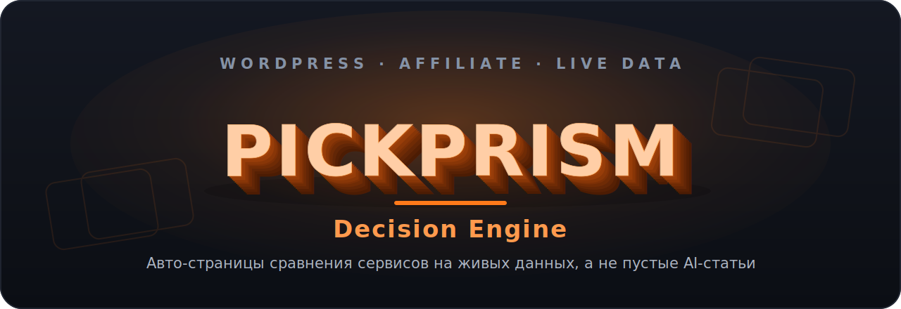

<div align="center">



<br>

[](https://wordpress.org/)
[](https://www.php.net/)
[](https://vitejs.dev/)
[](#путь-проекта-этап-3-из-8)
[](LICENSE)

### Сайт, который сам собирает страницы сравнения сервисов на живых данных и зарабатывает на партнерских комиссиях

**Не пустые статьи от нейросети, а актуальные цены и функции в таблицах, которые обновляются сами.**

</div>

---

## Идея простыми словами

Человек выбирает, каким сервисом пользоваться: какой взять хостинг, CRM, конструктор сайтов, VPN. Обычно он открывает десяток вкладок, лазит по сайтам, сравнивает тарифы вручную и все равно не уверен.

**PickPrism** дает ему одну готовую страницу. На ней настоящие цифры: тарифы, лимиты, ключевые функции, плюсы и минусы, собранные в таблицу. Человек быстро принимает решение и уходит по партнерской ссылке, а проект получает за это комиссию.

Так работают многие партнерские сайты. Разница PickPrism в двух вещах:

- **Страницы сравнения собираются из данных, а не пишутся руками по одной.** Это позволяет закрывать сотни запросов вида «X против Y» и «альтернативы X» без ручного труда на каждую страницу.
- **Данные живые.** Цены и характеристики не вморожены в текст на дату публикации, а подтягиваются и обновляются сами. У обычного блога через полгода все цифры устаревшие, у PickPrism они остаются свежими. В этом вся ценность.

Это личный сайт-актив: он строится один раз, а дальше работает и приносит доход в фоне.

## Путь проекта: этап 3 из 8

Проект строится по этапам, от идеи до работающего актива. Сейчас пройдены первые два этапа, идет третий.

```
Этап 3 из 8   ███████▌░░░░░░░░░░░░░   37%
```

> Ниже черновой план пути. Формулировки этапов уточняются по мере развития проекта.

| # | Этап | Что это значит | Статус |
|---|---|---|---|
| 1 | **Концепция и стратегия** | Идея Decision Engine, выбор ниши (сравнение софтверных сервисов), модель заработка на партнерских комиссиях | ✅ Готово |
| 2 | **Дизайн и презентационный слой** | Тема WordPress: витрина, статьи, поиск, лента, страницы категорий, комментарии. Это то, что лежит в репозитории | ✅ Готово |
| 3 | **Контент-модель и данные о сервисах** | Структура контента: тип «сервис» с атрибутами (цена, тариф, функции) и тип «сравнение». Первичное наполнение | 🔸 **Идет сейчас** |
| 4 | **Движок живых данных** | Сбор, нормализация и автообновление цен и функций из источников. Кэш и расписание обновлений | ⬜ Впереди |
| 5 | **Авто-генерация страниц сравнения** | Шаблоны «X против Y», «альтернативы X», подборки. Страницы собираются из данных автоматически | ⬜ Впереди |
| 6 | **Монетизация** | Партнерские сети, ссылки, id, клик-трекинг, аналитика конверсий | ⬜ Впереди |
| 7 | **SEO и запуск** | Техническое SEO, индексация, семантика, публичный запуск сайта | ⬜ Впереди |
| 8 | **Рост и автоматизация** | Масштабирование контента, аналитика, оптимизация, новые ниши | ⬜ Впереди |

**Где мы сейчас.** Полностью готов внешний вид и вся механика сайта как блога-витрины (этапы 1-2). Идет проработка того, как хранить и описывать сами сервисы и сравнения (этап 3). Движок живых данных, авто-генерация страниц сравнения и монетизация — впереди.

## Что уже работает

Готовый презентационный слой это полноценная тема WordPress. Что в ней есть:

- **Мгновенный поиск** в выпадающем окне: печатаешь, результаты появляются на лету
- **Бесконечная лента** статей с автоподгрузкой при прокрутке
- **Закрепленные материалы** с ручным порядком вывода
- **Управляемый контент шапки и подвала** через удобные поля в админке (ACF), без правки кода
- **Страница со всеми рубриками** по адресу `/categories/`
- **Красивые обложки без картинок**: если у материала нет фото, рисуется аккуратный градиент с буквой рубрики, у каждого материала свой стабильный цвет
- **Время чтения, прогресс-бар чтения, кнопка наверх, мобильное меню**
- **Своя система комментариев** с защитой от спама и пометкой «Автор»
- **Плавные появления блоков** с уважением к настройке «уменьшить движение» в системе

Все это работает быстро даже на 1000+ материалов и готово принять поверх себя движок данных.

## Как это будет устроено

```
                                  ┌──────────────────────────────┐
   Источники данных   ─────────▶  │   Движок данных (этапы 4-5)   │
   (цены, функции)                │   сбор · обновление · кэш     │
                                  └──────────────┬───────────────┘
                                                 │  таблицы сравнения
                                                 ▼
   ┌───────────────────────────────────────────────────────────────┐
   │              WordPress (эта тема, этапы 1-2, готово)            │
   │   шаблоны · дизайн-система · REST поиск/лента · ACF · sticky    │
   └──────────────┬─────────────────────────────┬──────────────────┘
                  │                              │
                  ▼                              ▼
        Страницы сравнения             Партнерские ссылки
        «X vs Y», «альтернативы»       (комиссия с перехода)
```

Тема сделана классическим способом (не FSE): предсказуемый PHP, кастомный дизайн, минимум зависимостей. Такой фундамент легко переживает подключение движка данных сверху и не мешает скорости.

## Стек

- **WordPress 6.0+**, классическая тема (не FSE), **PHP 7.4+** (проверено на 8.2)
- **SCSS + Vite 5** для сборки, **Vanilla JS** без фреймворков
- **ACF PRO** для управляемого контента (страница настроек «Настройки сайта»)
- **REST API темы**: `/wp-json/pickprism/v1/search` и `/feed` с ограничением частоты и кэшем
- Шрифты **Inter + Manrope**, анимации на CSS + `IntersectionObserver`
- Рекомендованные плагины-соседи: **LiteSpeed Cache**, **Rank Math SEO**, **Wordfence**

## Структура репозитория

```
pickprism/
├── style.css                       Метаданные темы
├── functions.php                   Точка входа, подгружает /inc
├── front-page.php home.php single.php   Главная / блог / статья
├── archive.php category.php tag.php search.php 404.php
├── header.php footer.php sidebar.php index.php comments.php
│
├── inc/                            Модули логики
│   ├── setup.php enqueue.php        supports, меню, подключение ассетов
│   ├── acf.php                      Страница настроек через ACF PRO
│   ├── ajax-search.php              REST поиск и лента + ограничение частоты
│   ├── sticky.php                   Порядок закрепленных материалов
│   ├── template-helpers.php         рубрики, оттенки обложек, время чтения
│   ├── categories-page.php          страница /categories/
│   ├── comments.php                 система комментариев
│   ├── caching.php query-optimizations.php   кэш и оптимизация запросов
│   ├── security.php cleanup.php      заголовки, чистка, отключение XML-RPC
│   └── fixtures.php                 генерация тестовых данных (WP-CLI)
│
├── template-parts/                 Блоки: hero, карточки, sidebar-*, share,
│                                   related, mobile-drawer и другие
├── templates/all-categories.php    Шаблон страницы /categories/
├── acf/                            Поля ACF (хранятся в git)
│
├── assets/
│   ├── src/scss/                   Исходники стилей
│   │        abstracts/_tokens.scss = дизайн-токены (правится отсюда)
│   ├── src/js/                     Исходники скриптов
│   └── dist/                       Собранные CSS/JS (коммитятся в git)
│
├── docs/banner.svg                 Обложка репозитория
├── CLAUDE.md PLAN.md TECH_DEBT.md  Рабочая документация проекта
├── LICENSE                         GPL-2.0
└── README.md
```

## Установка и разработка

```bash
# Активация темы (ассеты уже собраны, сборка на проде не нужна)
wp theme activate pickprism

# Разработка
npm install        # разово
npm run dev        # watch: пересборка при изменениях
npm run build      # продакшн-сборка
npm run clean      # очистка dist
```

После правок SCSS/JS нужно `npm run build` перед коммитом. Весь дизайн правится из одного места: `assets/src/scss/abstracts/_tokens.scss` (палитра, шрифты, радиусы, отступы).

## Тестовые данные

Чтобы проверять тему на реальном объеме, есть команда WP-CLI. Она генерирует до 1000 материалов, 15-20 рубрик, 50 тегов, картинки в медиабиблиотеку.

```bash
wp pickprism fixtures                    # полный прогон (~35 с)
wp pickprism fixtures --posts=200 --skip-images
wp pickprism fixtures --purge            # снести и сгенерировать заново
wp pickprism purge                       # только очистка тестовых данных
```

Очистка удаляет материалы и только те картинки, что помечены как тестовые (`_pickprism_fixture=1`).

## REST API темы

**`GET /wp-json/pickprism/v1/search`** — мгновенный поиск.
`q` (2..100 символов, обязательный), `limit` (1..20). Не более 60 запросов в минуту на IP.

**`GET /wp-json/pickprism/v1/feed`** — подгрузка ленты.
`type` (`home` | `category` | `tag` | `search`), `value`, `paged`, `per_page`. Не более 120 запросов в минуту на IP.

Оба эндпоинта исключены из кэша страниц (LiteSpeed).

## Производительность

Цели проекта на мобильных с 1000 материалов: **LCP < 1.5 c**, **CLS < 0.1**, **TBT < 200 мс**, Lighthouse **≥ 85**.

Размер собранного бандла:

| Ассет | Размер | Gzip |
|---|---|---|
| CSS | ~87 КБ | ~15 КБ |
| JS  | ~16 КБ | ~5.5 КБ |

Скорость обеспечивают: прогрев кэшей в `pre_get_posts`, ограничение ревизий, удаление лишних скриптов ядра, `srcset` и `loading="lazy"` на картинках.

## Безопасность

- Экранирование на выводе всегда (`esc_html`, `esc_url`, `esc_attr`, `wp_kses_post`), очистка на входе
- REST: проверка и очистка параметров, nonce, ограничение частоты запросов
- XML-RPC выключен, список пользователей закрыт, перебор авторов заблокирован
- Заголовки безопасности: `X-Content-Type-Options`, `Referrer-Policy`, `X-Frame-Options`, `Permissions-Policy`
- Секретов в репозитории нет. Ключи источников данных и партнерские id (когда появятся на этапах 4-6) идут только через переменные окружения, вне репозитория

## Лицензия

Проект распространяется под [GPL-2.0](LICENSE).
